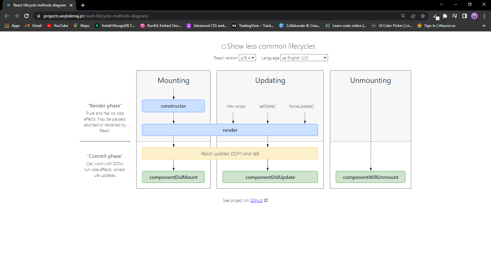

# In React class component is just class of javascript.
### This class extends Component from react library.

```
class Profile extends React.Component{
  
}
```
# This has a Render Method 
### without it we can not make class based component. Render method return DOM to be rendered on display

```
class Profile extends React.Component{
   render(){
    return(
        <div> render method of class <div>
    )
   }
}
```

# Passing Props in Class Component
### React attaches props to this keyword we can pass props same as from parent to child in class component too and should access with this keyword as this keyword refers to object of that class so we can say this keyword is object in simple term.

```
import React from "react";
import ClChildComponent from "./ClChildComponent";
class Profile extends React.Component{
  render(){
    return <div>
        <h1> Class Component </h1>
        <ClChildComponent
   // props => name="Classical Sumit" />
    </div>
  }
}
```
# State in class
### in constructor we define state of the component 

```
constructor(props){
       super(props)
    // this is the best place to define state
    this.state = {
        count : 0
       }
}
```
code must look like this
```
class ClChildComponent extends React.Component{
    constructor(props){
       super(props)
       this.state = {
        count : 0
       }
    }
    render(){
        return(
            <div>
                <h1>Child of class Component</h1>
                // we do not mutate state directly
                <h1>{this.props.name}</h1>
                <h1>{this.state.count}</h1>
            </div>
        )
    }
}
```
we can destructure it too 
const {count} = this.state

in class component all the state variables are created as the part of one object that is this keyword object

```
constructor(props){
       super(props)
       this.state = {
        count : 0,
        count2 : 0  
       }
    }
```
we can target this state variable or update with button click too

```
<button onClick={() => {
                    this.setState({
                        count:1,
                        count2:2
                    })
                }}>Set Count</button>

we do not mutate state directly.
never mutate state directly this.state = something
```
in class component we can modify object elements like this. class component gives us setState functionality

# Component Did Mount
Best Place to Call an API is Component Did Mount

```
import React from "react";

class ClChildComponent extends React.Component{
    constructor(props){
       super(props)
       this.state = {
        count : 0,
        count2:0
       }
    console.log('constructor');
    }
    componentDidMount(){
    console.log('component did mount');  
    }
    render(){
        console.log('render');
        return(
            <div>
                <h1>Child of class Component</h1>
                // we do not mutate state directly
                <h1>{this.props.name}</h1>
                <h1>{this.state.count}</h1>
                <button onClick={() => {
                    this.setState({
                        count:1,
                        count2:12
                    })
                }}>Set Count</button>
            </div>
        )
    }
}
export default ClChildComponent
```
# Why this is best place?
Because it is called only when component mounted. Only Once that is initially

# Lifecycle
Defining any new Component into render function trigger lifecycle of that component. it keeps happening until it does not find any new component and then finish

if there is more than one children then it wont call component did mount instead it will trigger lifecycle of next component

  ```
      Parent Constructor 
      Parent Render 

          First Child Constructor 
          First Child Render

          Second Child Constructor 
          Second Child Render 
                       it keeps going on like this if there more 
        
         First Child Component did Mount
         Second Child Component did Mount
    
    Parent - Component Did Mount

```

# And 

if you understand this diagram you will be understood class based lifecycle completely



When react is render things up there are two phase
1. Render phase 
2. Commit phase

In Render Phase there is Constructor and render function

Commit phase is actually the phase where react is modifying the DOM

Component did mount is called when my initial render is completed

it will batch up the rendering DOM for each child and then sequncely call component did mount and fill the data accordingly

we make async component did mount 


 ```
      Parent Constructor 
      Parent Render 

          First Child Constructor 
          First Child Render
         
    Parent - Component Did Mount
    
       First Child Component did Mount
       when this is async it will called after because it is fetching the data and react will called parent in idle time
```

React first finish render cycle for each then in commit phase act accordingly code i.e if async then it will take time in that it will move forward and comes back

# SetState will trigger re-render again

# Component did Update
it get called on each set state 
```
componentDidUpdate(prevProps, prevState){
  if(
    this.state.count !== prevState.count ||
    this.state.count !== prevState.count
  ){
    // code
  }
}

There can be so much nesting of if else depends on state variable 
in Functional based component we just mention dependency of state variable into array so this is the core this is happening behind the useEffect
Initially React dev used to write like this 

```

# Component Will Unmount
This will called for clean up when we go on another component inside our app so unmounting is necessary. space clean up is necessary
otherwise our app can cause some serious issues and it is not scalable if we do not clean up

# Use Effect is not equal to component did mount
Never say this some developers have bad habbit of saying this. they are not equal
 